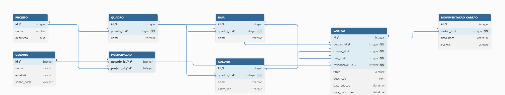

# ParaFazer

## Projeto Físico do Banco de Dados

### 1. Introdução

Este documento descreve o projeto físico do banco de dados relacional do ParaFazer, composto
por diagrama e descrição textual de cada tabela, suas colunas, chaves e relacionamentos.

### 2. Diagrama Entidade-Relacionamento (lógico)




> Relação textual: um `USUARIO` participa de vários `PROJETO` e vice-versa (N:N via
> `PARTICIPACAO`). Um `PROJETO` possui vários `QUADRO`. Um `QUADRO` possui várias `COLUNA`,
> `RAIA` e `CARTAO`. Cada `CARTAO` está em uma `COLUNA` e em uma `RAIA`, tem um `USUARIO`
> responsável, e gera vários registros em `MOVIMENTACAO_CARTAO`.

### 3. Definição das Tabelas (DDL)

```sql
CREATE TABLE usuario (
    id          INTEGER PRIMARY KEY,
    nome        TEXT    NOT NULL,
    email       TEXT    NOT NULL UNIQUE,
    senha_hash  TEXT    NOT NULL,
    criado_em   TEXT    NOT NULL
);

CREATE TABLE projeto (
    id          INTEGER PRIMARY KEY,
    nome        TEXT    NOT NULL,
    descricao   TEXT,
    criado_em   TEXT    NOT NULL
);

CREATE TABLE participacao (
    usuario_id  INTEGER NOT NULL REFERENCES usuario(id),
    projeto_id  INTEGER NOT NULL REFERENCES projeto(id),
    papel       TEXT    NOT NULL DEFAULT 'membro',
    PRIMARY KEY (usuario_id, projeto_id)
);

CREATE TABLE quadro (
    id          INTEGER PRIMARY KEY,
    projeto_id  INTEGER NOT NULL REFERENCES projeto(id),
    nome        TEXT    NOT NULL,
    criado_em   TEXT    NOT NULL
);

CREATE TABLE coluna (
    id          INTEGER PRIMARY KEY,
    quadro_id   INTEGER NOT NULL REFERENCES quadro(id),
    nome        TEXT    NOT NULL,           -- A FAZER | FAZENDO | FEITO
    ordem       INTEGER NOT NULL,
    wip_limit   INTEGER NOT NULL DEFAULT 0  -- 0 = sem limite
);

CREATE TABLE raia (
    id          INTEGER PRIMARY KEY,
    quadro_id   INTEGER NOT NULL REFERENCES quadro(id),
    nome        TEXT    NOT NULL,
    ordem       INTEGER NOT NULL
);

CREATE TABLE cartao (
    id            INTEGER PRIMARY KEY,
    quadro_id     INTEGER NOT NULL REFERENCES quadro(id),
    coluna_id     INTEGER NOT NULL REFERENCES coluna(id),
    raia_id       INTEGER REFERENCES raia(id),
    nome          TEXT    NOT NULL,
    responsavel_id INTEGER REFERENCES usuario(id),
    data_limite   TEXT,
    prioridade    TEXT    NOT NULL DEFAULT 'media',  -- baixa | media | alta
    descricao     TEXT,
    criado_em     TEXT    NOT NULL
);

CREATE TABLE movimentacao_cartao (
    id              INTEGER PRIMARY KEY,
    cartao_id       INTEGER NOT NULL REFERENCES cartao(id),
    coluna_origem   INTEGER REFERENCES coluna(id),
    coluna_destino  INTEGER REFERENCES coluna(id),
    raia_origem     INTEGER REFERENCES raia(id),
    raia_destino    INTEGER REFERENCES raia(id),
    movido_em       TEXT    NOT NULL
);
```

### 4. Descrição das Tabelas

| Tabela | Propósito | Chaves e relacionamentos |
| --- | --- | --- |
| **usuario** | Armazena os usuários do sistema. | PK `id`; `email` único. |
| **projeto** | Representa um projeto. | PK `id`. |
| **participacao** | Associa usuários a projetos (N:N) e define o papel. | PK composta (`usuario_id`,`projeto_id`); FKs para `usuario` e `projeto`. |
| **quadro** | Quadro Kanban de um projeto. | PK `id`; FK `projeto_id` → `projeto`. |
| **coluna** | Colunas do quadro (A FAZER, FAZENDO, FEITO) e o limite de WIP. | PK `id`; FK `quadro_id` → `quadro`. |
| **raia** | Raias (swimlanes) do quadro. | PK `id`; FK `quadro_id` → `quadro`. |
| **cartao** | Cartão de atividade, com os campos exigidos. | PK `id`; FKs para `quadro`, `coluna`, `raia` e `usuario` (responsável). |
| **movimentacao_cartao** | Histórico de movimentação dos cartões, base para as métricas. | PK `id`; FK `cartao_id` → `cartao`; FKs de origem/destino para `coluna` e `raia`. |

A tabela `movimentacao_cartao` é o que torna possível calcular *lead time* e *cycle time*, pois
guarda o instante de cada transição de coluna do cartão.
