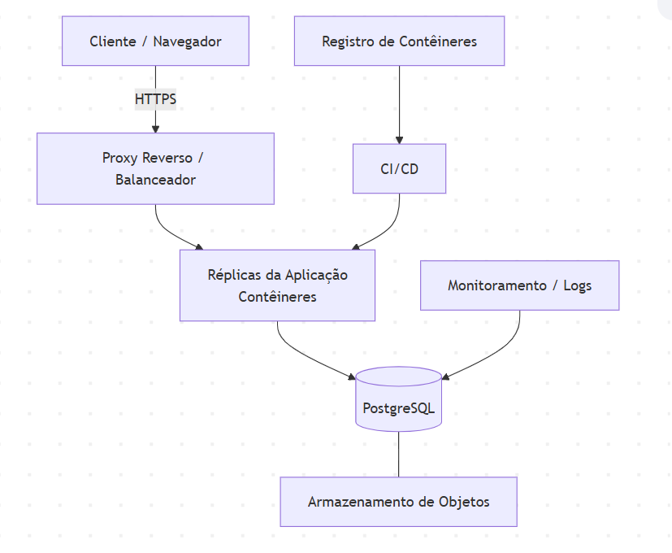

# ParaFazer

## Descrição da Infraestrutura de Implantação

### 1. Introdução

Este documento descreve o hardware, o software e os serviços necessários para colocar o
ParaFazer em produção. O protótipo roda localmente; esta seção projeta o ambiente de produção
adotando uma abordagem baseada em contêineres e serviços gerenciados em nuvem.

### 2. Software

| Camada | Tecnologia | Função |
| --- | --- | --- |
| Aplicação | Python 3.10+ | Executa o núcleo de domínio e os serviços do sistema. |
| Servidor de aplicação/web | Servidor WSGI/ASGI atrás de um proxy reverso | Atende as requisições dos clientes. |
| Banco de dados | PostgreSQL | Persistência relacional transacional em produção. |
| Empacotamento | Docker | Padroniza o ambiente e isola dependências. |
| Orquestração (opcional) | Orquestrador de contêineres | Escala e gerencia os contêineres em produção. |
| Sistema operacional | Linux | Hospeda os contêineres e serviços. |

### 3. Hardware

| Componente | Especificação mínima sugerida | Observação |
| --- | --- | --- |
| Servidor de aplicação | 2 vCPU, 4 GB RAM | Escala horizontal por réplicas conforme a carga. |
| Servidor de banco de dados | 2 vCPU, 8 GB RAM, armazenamento SSD com redundância | Pode ser instância gerenciada. |
| Armazenamento | Volume persistente para o banco e para anexos | Cópia de segurança periódica. |
| Estação cliente | Computador padrão com navegador atualizado | Para a interface gráfica/web. |

### 4. Serviços

- **Banco de dados gerenciado (PostgreSQL):** persistência com *backup* automático e alta
  disponibilidade.
- **Armazenamento de objetos:** guarda anexos e artefatos estáticos.
- **Proxy reverso / balanceador de carga:** distribui requisições entre réplicas e encerra
  TLS (HTTPS).
- **Registro de contêineres:** armazena as imagens Docker da aplicação.
- **Monitoramento e logs:** coleta métricas de uso, disponibilidade e registros de erro.
- **Pipeline de CI/CD:** automatiza testes, construção da imagem e implantação.

### 5. Topologia de implantação (visão)

### 6. Considerações

- A separação entre aplicação e banco permite escalar cada parte de forma independente.
- O uso de contêineres torna o ambiente reproduzível entre desenvolvimento, homologação e
  produção.
- As cópias de segurança do banco e dos anexos garantem recuperação em caso de falha.
